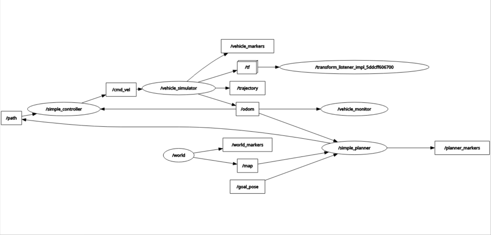
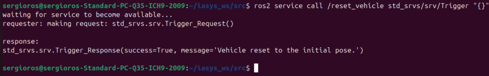
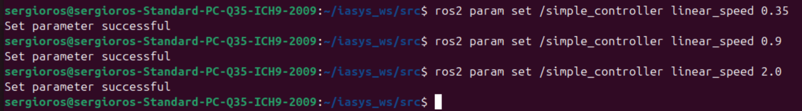
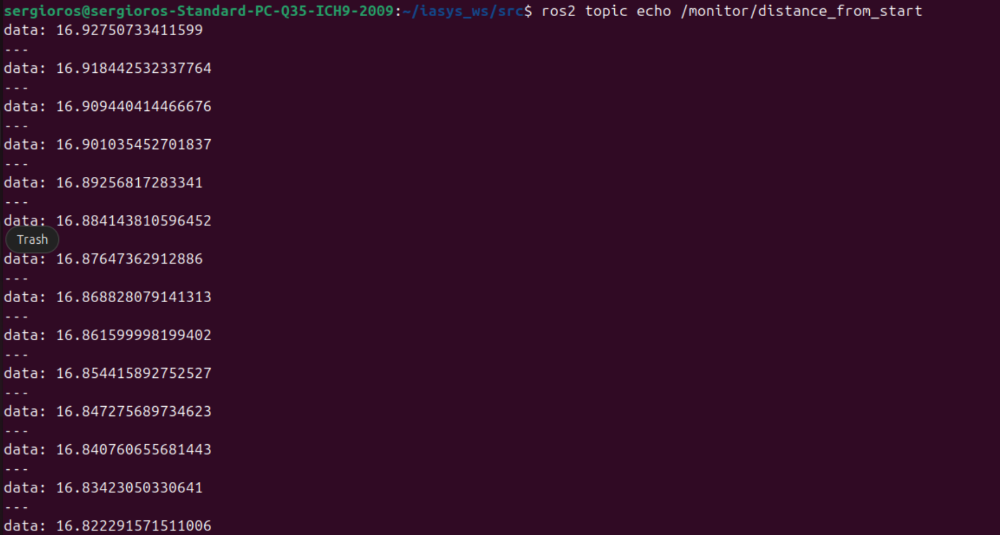
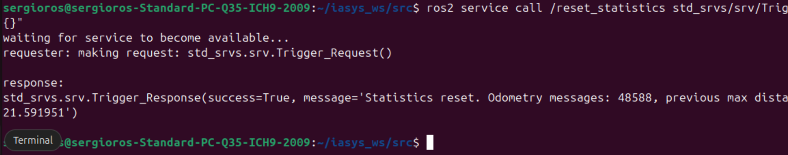
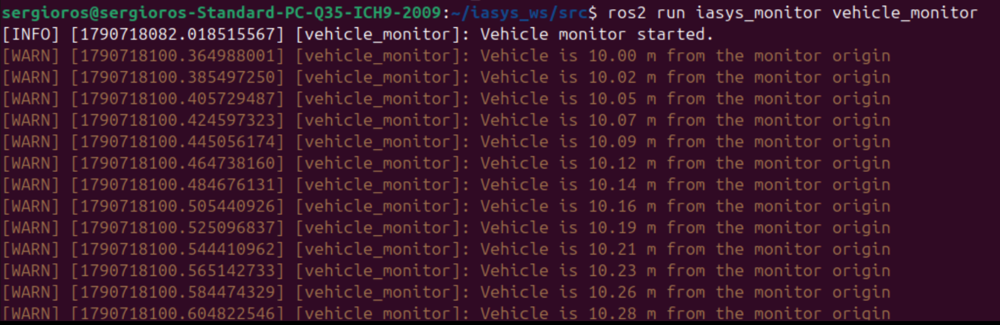

# LAB 2 Deliverables

Followed indications and solved exercises from [lab2_pdf](./IASYS-LAB2-2026.pdf)

## Node/interface table for the main nodes

| Node                 | Subscribes to                                      | Publishes                                                                                            | Other interfaces                                          |
| -------------------- | -------------------------------------------------- | ---------------------------------------------------------------------------------------------------- | --------------------------------------------------------- |
| `/world`             | `/parameter_events`                                | `/map`, `/world_markers`, `/parameter_events`, `/rosout`                                             | Parameter management services                             |
| ---                  | ---                                                | ---                                                                                                  | ---                                                       |
| `/vehicle_simulator` | `/cmd_vel`, `/parameter_events`                    | `/odom`, `/tf`, `/trajectory`, `/vehicle_marker`, `/vehicle_markers`, `/parameter_events`, `/rosout` | `/reset_vehicle` (Trigger); parameter management services |
| ---                  | ---                                                | ---                                                                                                  | ---                                                       |
| `/simple_planner`    | `/goal_pose`, `/map`, `/odom`, `/parameter_events` | `/path`, `/goal_marker`, `/planner_markers`, `/parameter_events`, `/rosout`                          | Parameter management services                             |
| ---                  | ---                                                | ---                                                                                                  | ---                                                       |
| `/simple_controller` | `/odom`, `/path`, `/parameter_events`              | `/cmd_vel`, `/parameter_events`, `/rosout`                                                           | Parameter management services                             |

## RQT_GRAPH

## Calling /reset_vehicle and changing linear speed at runtime

### Calling /reset_vehicle

### Changing linear speed at runtime

### Publishing to /monitor/distance_from_start

### /reset_statistics_service call from ROS2 CLI

### RCLCPP_WARN

